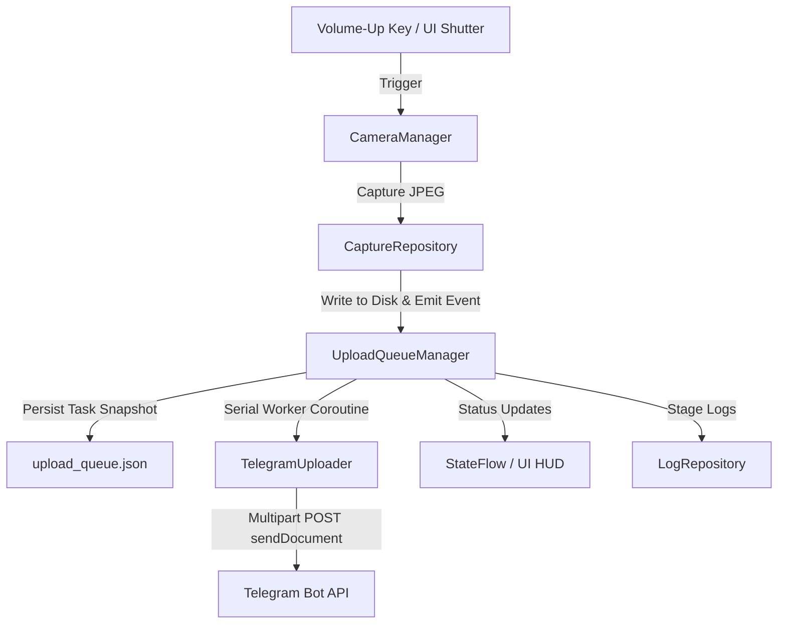

# SnapRelay 📷✈️

[](https://developer.android.com)
[](https://kotlinlang.org)
[](https://developer.android.com/jetpack/compose)
[](https://developer.android.com/training/camerax)
[](LICENSE)

**SnapRelay** is a native, internal-use Android application designed for fixed-rig environments (e.g., a tripod-mounted phone photographing a laptop screen). Pressing the physical **Volume-Up** key instantly captures a high-resolution snapshot and enqueues it for background serial upload to a **Telegram Bot** via uncompressed `sendDocument` API calls—all while the live camera preview runs continuously without interruption.

---

## 🌟 Key Features

* **📷 Hardware Volume-Up Trigger:** Intercepts `KEYCODE_VOLUME_UP` with 400ms debouncing. Captures photos instantly without triggering the system media volume slider overlay.
* **🔬 Maximum Sensor Resolution & ISP Tuning:** Uses CameraX `ResolutionStrategy.HIGHEST_AVAILABLE_STRATEGY` to capture at full sensor megapixel count (e.g., 50MP / 12MP), 100% loss-less JPEG compression quality, and hardware-level ISP edge sharpening (`EDGE_MODE_HIGH_QUALITY`) tailored for crisp laptop text legibility.
* **🎯 Fixed-Rig Manual Controls (HUD Chips):**
  * **AF LOCK / AF AUTO:** Lock focus distance once aligned with your laptop screen.
  * **AE LOCK / AE AUTO:** Lock exposure so brightness doesn't flicker when laptop screen content changes.
  * **FLASH ON / OFF:** Toggle device torch for dark environment lighting.
  * **ISO & EV Sliders:** Adjust manual ISO sensitivity and Exposure Compensation (-4 to +4 EV).
  * **Tap-to-Focus:** Tap anywhere on the live preview screen to focus on specific code or text.
* **⚡ Non-Blocking Background Upload Queue:**
  * Serial worker coroutine operating on `Dispatchers.IO`.
  * Disk-persisted queue (`upload_queue.json`) for process death and phone reboot recovery.
  * Automatic exponential backoff retries (2s, 4s, 8s… capped at 60s).
* **✈️ Direct Telegram Integration:** Uses OkHttp `multipart/form-data` to hit `sendDocument`, delivering uncompressed JPEGs straight to your Telegram chat.
* **💾 Storage Management:** Saved in app-scoped private storage (`Android/data/com.snaprelay/files/Pictures/`) to prevent gallery clutter. Includes live disk usage stats, 1-tap cache clear, and a **"Delete After Upload"** auto-cleanup switch.
* **📜 Live Debug Logs:** Built-in 500-entry ring buffer log screen showing real-time event stages (`Captured`, `Queued`, `Uploading`, `Success`, `Failure`).

---

## 🏗 Architecture & Data Flow



---

## 🚀 Step-by-Step Setup Guide

### 📋 Prerequisites

1. **Computer:** Windows, macOS, or Linux with [Android Studio Ladybug (or newer)](https://developer.android.com/studio) installed.
2. **Android Phone:** Running Android 8.0 (API level 26) or higher.
3. **USB Cable:** To connect your phone to your computer.
4. **Telegram Account:** To set up your personal bot.

---

### Step 1: Create Your Telegram Bot & Get Credentials

1. Open Telegram on your phone or PC and search for **`@BotFather`** (verified bot with a blue checkmark).
2. Start a chat and send: `/newbot`
3. Enter a display name (e.g., `SnapRelay Bot`) and a unique username ending in `bot` (e.g., `my_snaprelay_bot`).
4. `@BotFather` will give you an **HTTP API Token**:
   > Example Token: `7123456789:AAFg...xYZ123`
5. Open your newly created bot in Telegram and tap **Start** (or send `/start`).
6. Search for **`@userinfobot`** on Telegram and tap **Start**. It will reply with your personal **Chat ID**:
   > Example Chat ID: `987654321`

---

### Step 2: Clone & Open the Repository

```bash
git clone https://github.com/Ruvaifa/SnapRelay.git
```

1. Launch **Android Studio**.
2. Select **Open** and choose the `SnapRelay` directory.
3. Wait for Android Studio to complete the automatic **Gradle Sync** (downloading dependencies).

---

### Step 3: Enable USB Debugging on Your Phone

1. On your Android phone, go to **Settings → About Phone**.
2. Tap **Build Number** 7 times until you see: *"You are now a developer!"*
3. Go to **Settings → System → Developer Options**.
4. Turn **USB Debugging** to **ON**.
5. Connect your phone to your PC via USB cable. Tap **Allow USB Debugging** on the phone prompt.

---

### Step 4: Build & Install SnapRelay

1. In Android Studio, look at the top toolbar device dropdown menu and select your connected phone.
2. Click the green **Run (▶)** button (or press `Shift + F10`).
3. Once installed on your phone, tap **"Grant Permission"** when prompted for camera access.

---

### Step 5: Configure App Credentials

1. Tap the **Settings Gear Icon ⚙️** at the top right of the Camera screen.
2. Paste your **Telegram Bot Token** and **Chat ID** into the input fields.
3. (Optional) Toggle **"Delete After Upload"** to **ON** if you want local JPEGs automatically deleted after sending.
4. Tap **"Test Upload Latest Photo"** to send a test snapshot directly to your Telegram chat!

---

## 🎛️ Adjustable Controls & Settings

### 📱 Camera Screen HUD Controls
| Control | Behavior | Best Used For |
|---|---|---|
| **AF LOCK / AF AUTO** | Toggles Auto Focus vs. Locked Focus | Locking focus distance once fixed on tripod |
| **AE LOCK / AE AUTO** | Toggles Auto Exposure vs. Locked Exposure | Preventing flickering when laptop screen text changes |
| **FLASH ON / OFF** | Toggles phone flashlight/torch | Dark room environments |
| **ISO Slider** | Adjusts sensor light sensitivity (100–3200) | Manual noise reduction in low light |
| **EV Slider** | Exposure Compensation (-4 to +4 EV) | Fine-tuning screen brightness contrast |
| **Tap-to-Focus** | Tap anywhere on live preview | Focusing precisely on small code/text |

### ⚙️ Settings Screen Configuration
* **Telegram Bot Token:** Your secret bot HTTP token.
* **Telegram Chat ID:** Your personal or group chat ID.
* **Delete After Upload:** Automatically deletes JPEGs from phone memory after Telegram confirmation.
* **Local Storage Management:** Displays count/MB of stored photos with a 1-tap **"Clear All Local Snapshots"** button.
* **View Live Upload & Activity Logs:** Opens the real-time logging screen to debug network timeouts or capture events.

---

## 🔧 Project Structure

```
SnapRelay/
 ├── app/src/main/java/com/snaprelay/
 │    ├── SnapRelayApp.kt              # Application class
 │    ├── MainActivity.kt              # Single Activity, NavHost & volume key hook
 │    │
 │    ├── camera/
 │    │    ├── CameraManager.kt          # CameraX provider, full sensor resolution, tap-focus
 │    │    ├── Camera2ControlBridge.kt    # ISP edge sharpening, noise reduction, AE/AF/Torch
 │    │    ├── CameraCapabilities.kt      # Introspects device hardware capabilities
 │    │    ├── CameraSettingsState.kt     # In-memory camera settings state
 │    │    └── VolumeKeyCaptureHandler.kt # Intercepts & debounces KEYCODE_VOLUME_UP
 │    │
 │    ├── capture/
 │    │    ├── CaptureRepository.kt      # File naming, storage directory & cleanup
 │    │    └── CaptureEvent.kt           # Capture event flow
 │    │
 │    ├── upload/
 │    │    ├── UploadQueueManager.kt     # Serial worker coroutine, backoff & retry loop
 │    │    ├── UploadTask.kt             # Task data class & status enum
 │    │    ├── UploadQueueStore.kt       # JSON persistence (upload_queue.json)
 │    │    └── TelegramUploader.kt       # OkHttp multipart sendDocument API client
 │    │
 │    ├── settings/
 │    │    ├── SettingsRepository.kt     # Jetpack DataStore Preferences wrapper
 │    │    └── AppSettings.kt            # App settings data model
 │    │
 │    ├── logging/
 │    │    ├── LogRepository.kt          # 500-entry ring buffer log manager
 │    │    └── LogEntry.kt               # Structured log entry model
 │    │
 │    └── ui/
 │         ├── camera/                  # CameraPreviewView, CameraScreen, HUD chips
 │         ├── settings/                # SettingsScreen
 │         └── logs/                    # LogScreen
```

---

## ❓ Troubleshooting & FAQ

#### Q: The laptop screen text in Telegram looks blurry. What should I do?
1. Tap directly on the laptop text on the live camera preview screen to trigger **tap-to-focus**.
2. Once sharp, tap the **AF LOCK** chip at the bottom so the camera locks focus at that exact distance.
3. Make sure the phone lens is clean and the tripod distance is fixed.

#### Q: Photos are not arriving in my Telegram chat.
1. Open **Settings ⚙️ → View Live Upload & Activity Logs**.
2. Check for red error entries:
   * **`HTTP 401`:** Incorrect Bot Token. Re-check token from `@BotFather`.
   * **`HTTP 400` / `404`:** Invalid Chat ID or you haven't pressed **`/start`** in your Telegram bot chat yet.
   * **`Network Error`:** Ensure phone has active Wi-Fi or mobile data.

#### Q: Where are photos stored on my phone?
Photos are saved in app-scoped private storage at: `Android/data/com.snaprelay/files/Pictures/`. You can view or wipe them anytime via **Settings ⚙️ → Clear All Local Snapshots**.

---

## 📄 License & Forking

This project is open-source under the **[MIT License](LICENSE)**. Feel free to fork this repository, customize the UI or backend upload destination (e.g., Discord, S3, custom webhook), and use it for your own hardware setups!